# GitHub Search App with Twilio Authentication

A modern web application for searching GitHub users. It includes authentication via Twilio for secure phone number verification, supports marking profiles as favorites, paginating through search results, and managing personal information for a seamless user experience.

---

## 📌 Table of Contents

1. [Introduction](#introduction)
2. [Features](#features)
3. [Project Structure](#project-structure)
4. [Usage](#usage)
   - [1️⃣ Login Flow](#1️⃣-login-flow)
   - [2️⃣ User Search](#2️⃣-user-search)
   - [3️⃣ Pagination](#3️⃣-pagination)
   - [4️⃣ Liking a GitHub Profile](#4️⃣-liking-a-github-profile)
   - [5️⃣ Profile Dialog](#5️⃣-profile-dialog)
5. [Screenshots](#screenshots)
6. [Installation & Running](#installation--running)
7. [Environment Variables](#environment-variables)
8. [Notes](#notes)

---

## Introduction

This app allows users to search for GitHub user profiles, mark them as favorites, and ensures that the liked state persists even after a page refresh. The application supports secure user authentication and phone number verification via Twilio, and it is fully responsive across both desktop and mobile devices.

---

## Features

- Login using phone number (2-step: enter phone number and access code)
- Search for GitHub users (table and grid views) — no login required
- Like/unlike user profiles
- Persist liked status
- Paginate search results
- View user profile information and list of favorites
- Connect to backend for authentication and data persistence

---

## Project Structure

The project is organized into two main directories: client (frontend) and server (backend). Below is an overview of the structure:

### Client (Frontend)

````text

client/ # Frontend code (React + Vite + TypeScript)
│ ├── dist/ # Build output directory (generated after build)
│ ├── node_modules/ # Dependency directory (managed by npm/pnpm)
│ ├── public/ # Static assets (e.g., favicon, index.html)
│ │ ├── index.html # Main HTML template
│ ├── src/ # Source code for the frontend
│ │ ├── assets/ # Images, styles, and other static assets
│ │ ├── components/ # Reusable React components (e.g., SearchBar, ProfileCard)
│ │ ├── config/ # Configuration files or settings
│ │ ├── constants/ # Application-wide constants
│ │ ├── contexts/ # React context files for state management
│ │ ├── features/ # Feature-specific modules
│ │ ├── hooks/ # Custom React hooks for logic reuse
│ │ ├── lib/ # Utility libraries or shared logic
│ │ ├── pages/ # Page-level components (e.g., Login, Search)
│ │ ├── routes/ # Routing configuration
│ │ ├── services/ # API call utilities (e.g., GitHub API, Twilio)
│ │ ├── types/ # TypeScript type definitions
│ │ ├── utils/ # Utility functions
│ │ ├── App.css # Global styles for the app
│ │ ├── App.tsx # Main app component
│ │ ├── index.css # Global CSS
│ │ ├── main.tsx # Entry point for React
│ │ └── vite-env.d.ts # TypeScript declaration file for Vite
│ ├── .env.example # Template for frontend environment variables
│ ├── .gitignore # Git ignore file
│ ├── components.json # Component metadata
│ ├── eslint.config.js # ESLint configuration
│ ├── package.json # Project dependencies and scripts
│ ├── pnpm-lock.yaml # pnpm lock file for dependency management
│ ├── README.md # Local README (if any)
│ ├── tsconfig.app.json # TypeScript configuration for the app
│ ├── tsconfig.json # Main TypeScript configuration
│ ├── tsconfig.node.json # TypeScript configuration for Node.js
│ └── vite.config.ts # Vite configuration file
```text

### Server (Backend)

```text
├── server/ # Backend code (Node.js + Express + TypeScript)
│ ├── dist/ # Build output directory (generated after build)
│ ├── node_modules/ # Dependency directory (managed by npm/pnpm)
│ ├── src/ # Source code for the backend
│ │ ├── config/ # Configuration files (e.g., firebase, environment settings)
│ │ ├── controller/ # Request handlers for API endpoints
│ │ ├── middleware/ # Custom middleware (e.g., rate limiting, authentication)
│ │ ├── routes/ # API route definitions
│ │ ├── services/ # Business logic (e.g., Twilio, Firebase integration)
│ │ ├── utils/ # Utility functions
│ │ ├── app.ts # Main application setup
│ │ └── server.ts # Server entry point
│ ├── .env.example # Template for backend environment variables
│ ├── .gitignore # Git ignore file
│ ├── package.json # Project dependencies and scripts
│ ├── pnpm-lock.yaml # pnpm lock file for dependency management
│ ├── serviceAccountKey.json # Firebase service account key (if used)
│ ├── swagger.yaml # Swagger/OpenAPI specification
│ └── tsconfig.json # TypeScript configuration
```text

---

## Usage

### 1 Login Flow

- **Phone number input screen**
  

- **Access code input screen**
  

---

### 2️⃣ User Search

- **Search Bar in the Navigation (Before Login)**
  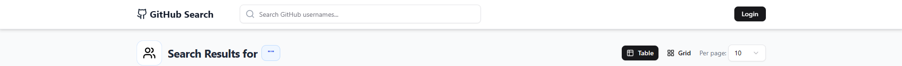
- **Search Bar in the Navigation (After Login)**
  

- **Search results in table or grid views**
  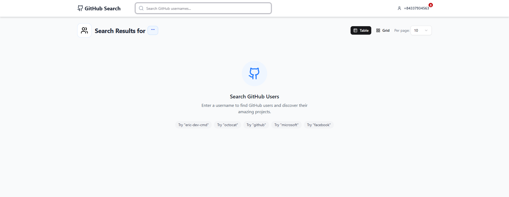
  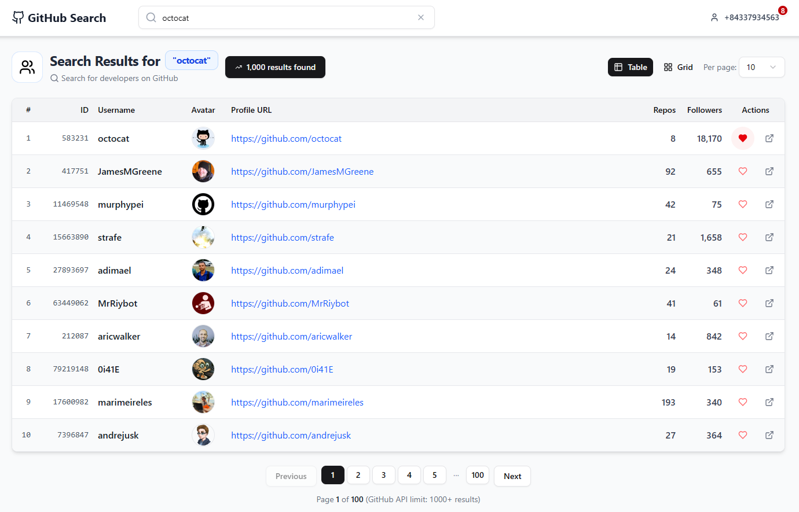
  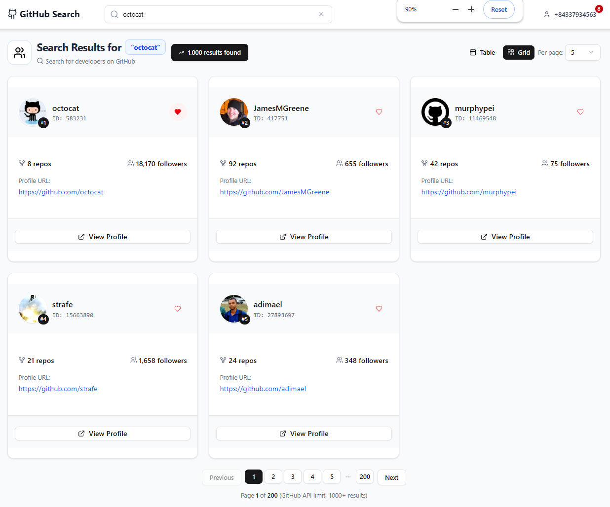

---

### 3️⃣ Pagination

- **Pagination controls at the bottom of the page**
  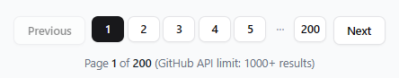
  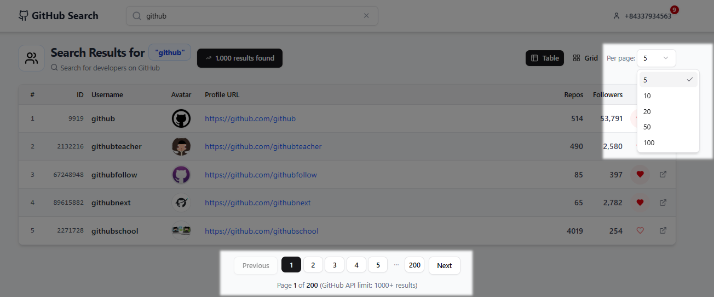

---

### 4️⃣ Liking a GitHub Profile

- **Heart icon in both unliked and liked states**
  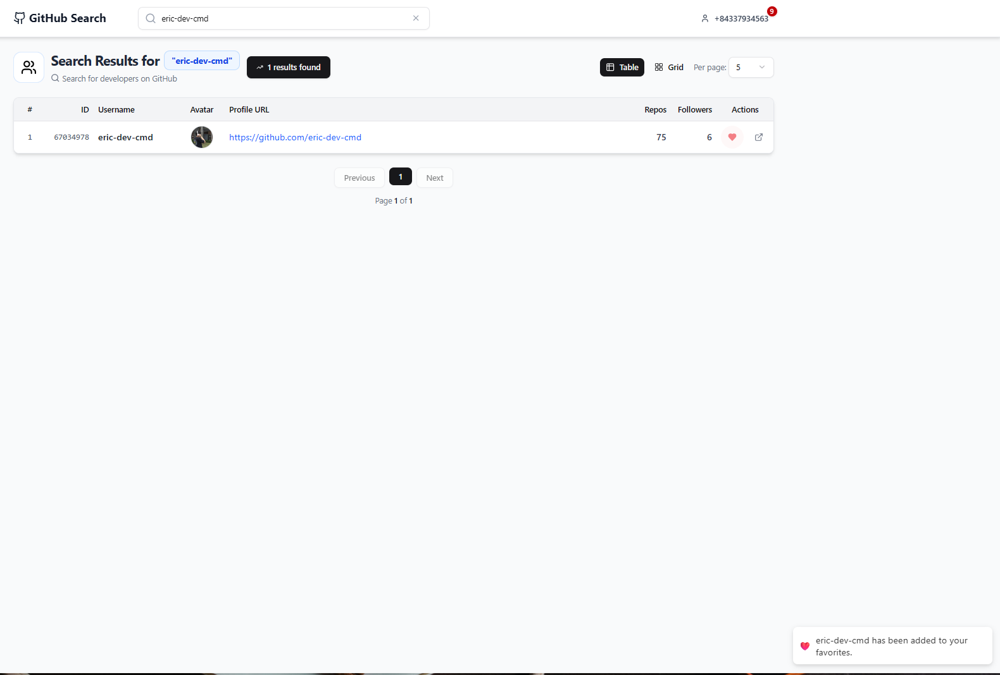
  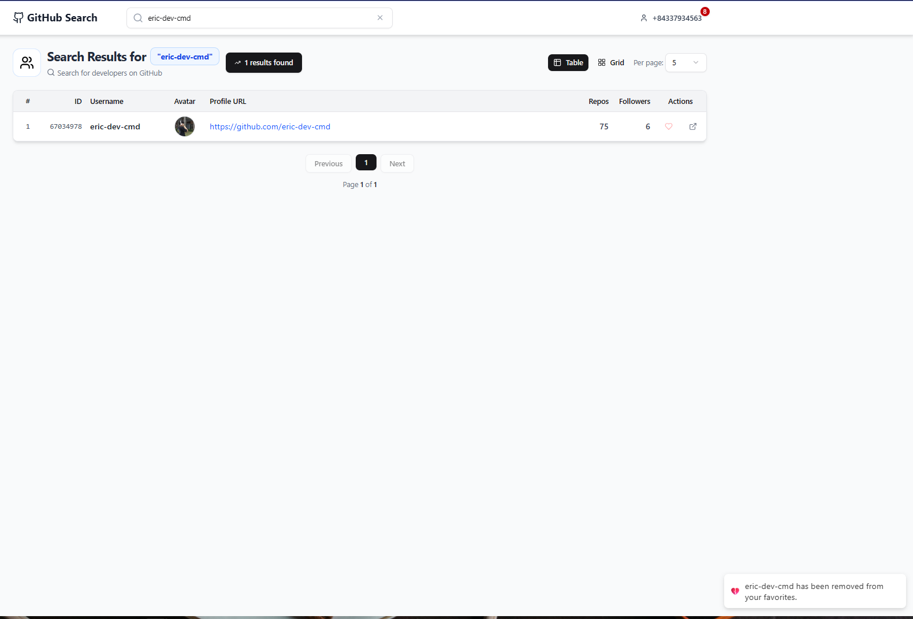

- **Bonus: highlight icon after refreshing (to prove persistence)**
  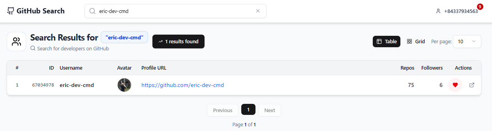

---

### 5️⃣ Profile Dialog

- **User’s phone number displayed**
  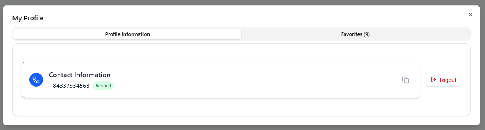

- **List of liked GitHub profiles**
  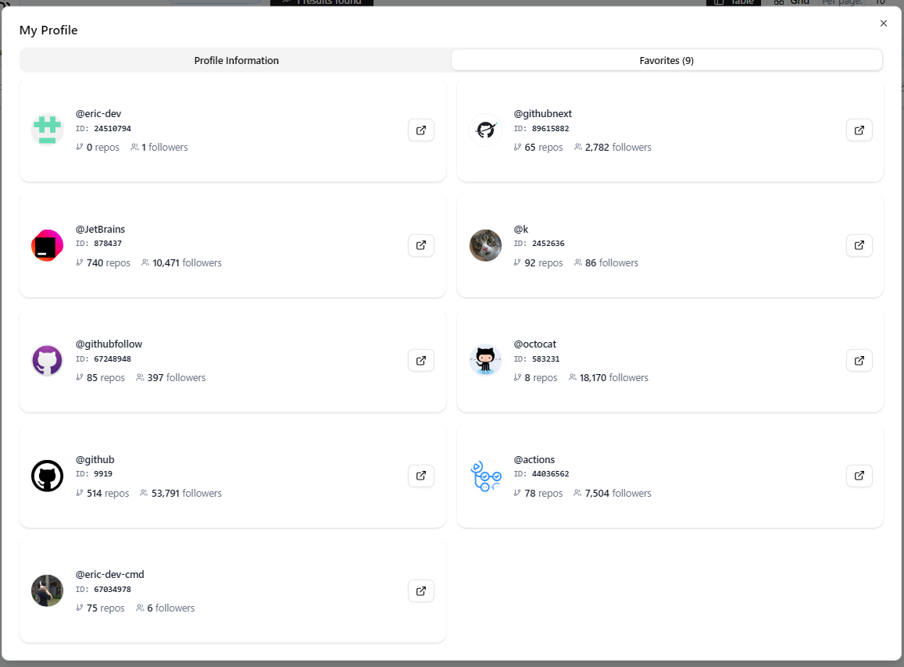

---

## Screenshots

> All screenshots are stored in the `screenshots` folder for easy management.

---

## ⚙️ Installation & Running

### Prerequisites

- [Node.js (includes npm) – Download & Install Node.js](https://nodejs.org/)
- [pnpm – Install pnpm](https://pnpm.io/installation)

---

### Steps

```bash
# Clone the repository
git clone <repo-url>
cd <project-folder>

# Install dependencies for the frontend
cd client
pnpm install

# Install dependencies for the backend
cd ../server
pnpm install

# Run the frontend
cd ../client
pnpm dev

# Run the backend
cd ../server
pnpm dev
````

---

## Environment Variables

This project uses environment variables for both the frontend and backend. Make sure to create .env files following these examples:

### 📁 Frontend (client/.env.example)

```env
# Base URL of the API backend
VITE_API_BASE_URL=http://localhost:5000/api
```

### 📁 Backend (server/.env.example)

```env
# Server Configuration

PORT=5000
NODE_ENV=development

# Firebase config

FIREBASE_DATABASE_URL=your_firebase_database_url_here
GOOGLE_APPLICATION_CREDENTIALS=./serviceAccountKey.json

# Firebase Configuration

FIREBASE_API_KEY=your_firebase_api_key_here
FIREBASE_AUTH_DOMAIN=your_firebase_auth_domain_here
FIREBASE_PROJECT_ID=your_firebase_project_id_here
FIREBASE_STORAGE_BUCKET=your_firebase_storage_bucket_here
FIREBASE_MESSAGING_SENDER_ID=your_firebase_messaging_sender_id_here
FIREBASE_APP_ID=your_firebase_app_id_here
FIREBASE_MEASUREMENTID=your_firebase_measurement_id_here

# Twilio Configuration

TWILIO_ACCOUNT_SID=your_twilio_account_sid_here
TWILIO_AUTH_TOKEN=your_twilio_auth_token_here
TWILIO_FROM_PHONE=your_twilio_from_phone_here
TWILIO_TO_PHONE=your_twilio_to_phone_here

# GitHub API

GITHUB_API_TOKEN=your_github_api_token_here

# Security

CORS_ORIGIN=http://localhost:3000

# OTP Rate Limiter

OTP_RATE_LIMIT_WINDOW_MS=60000
OTP_RATE_LIMIT_MAX_REQUESTS=5

# GitHub Rate Limiter

GITHUB_RATE_LIMIT_WINDOW_MS=60000
GITHUB_RATE_LIMIT_MAX_REQUESTS=60

# Swagger Rate Limiter

SWAGGER_RATE_LIMIT_WINDOW_MS=60000
SWAGGER_RATE_LIMIT_MAX_REQUESTS=10
```

---

## Notes

- 📌 Copy `.env.example` to `.env` in both `client` and `server` directories, then fill in the required values.
- 📌 Make sure to replace all placeholder values like `your_..._here` with your actual credentials and URLs.
- 📌 For Twilio, create an account at [Twilio Console](https://www.twilio.com/console) to get `TWILIO_ACCOUNT_SID`, `TWILIO_AUTH_TOKEN`, `TWILIO_TO_PHONE`, and `TWILIO_FROM_PHONE`.
- 📌 For GitHub API, create a personal token at [GitHub Developer Settings](https://github.com/settings/tokens).
- 📌 If using Firebase, ensure you have a valid `serviceAccountKey.json` file placed in the `server/` directory. Refer to [Firebase Admin SDK](https://firebase.google.com/docs/admin/setup#initialize-sdk) for instructions.
- 📌 All screenshots should be placed in the `screenshots` folder following the paths listed above.
